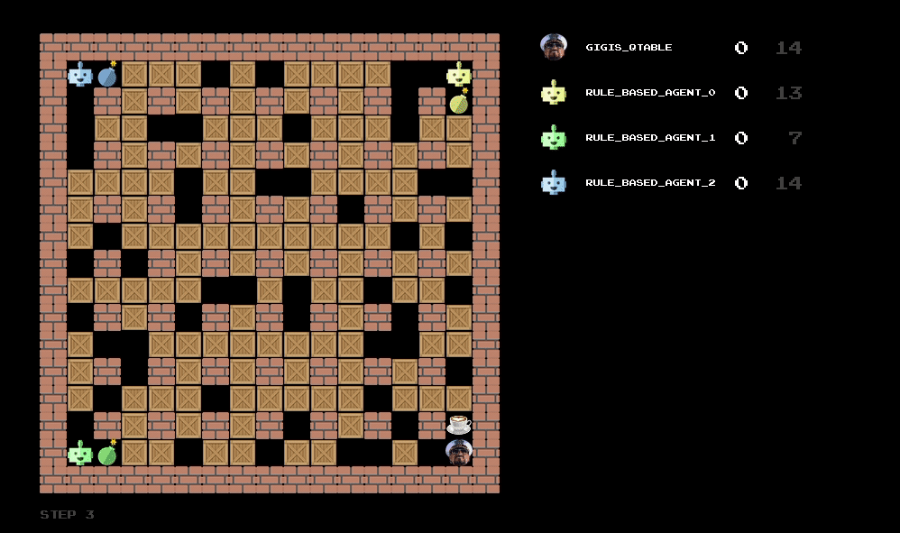

# Bomberman RL
This is a cloned repository of https://github.com/ukoethe/bomberman_rl. It is part of a final project for Fundamentals of Machine Learning course offered at Heidelberg University, where the goal is to develop a capable agent using Reinforcement Learning for the classic game Bomberman.

# Developed agents

## "Il Capitano della Tabella"
The implementation can be found in `agents_code/gigis_qtable/` folder.

## "Il Capitano dell’ Appro-SSI-mazione"
The implementation can be found in `agents_code/gigis_rf/` folder.

